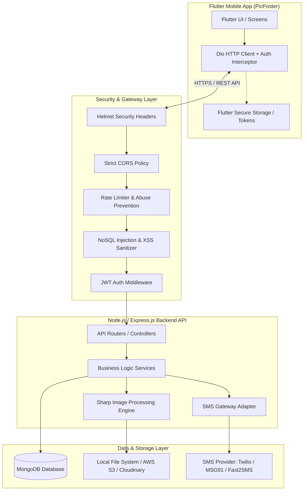

# PicPoster Backend Architecture & Technical Specification Document

**Technology Stack:** Node.js (v20+ LTS) · Express.js · MongoDB (Mongoose) · JWT · OTP SMS Gateway  
**Application Type:** Poster / Banner Creation & Sharing Mobile Platform (Flutter App)  
**Authentication Strategy:** Mobile Number + One-Time Password (OTP) with Secure Refresh Tokens  

---

## 1. System Architecture Overview



---

## 2. Security Architecture & Abuse Prevention

### 2.1 OTP Generation & Verification Security
1. **Cryptographically Secure OTP**: Generated using `crypto.randomInt(100000, 999999)` (6 digits).
2. **OTP Hashing**: Never store plain OTPs in the database. Hash with `bcrypt` or `HMAC-SHA256` before saving.
3. **Short Expiration (TTL)**: OTP valid for strictly **5 minutes**. Automatically deleted via MongoDB TTL Index.
4. **Attempt Throttling**: Maximum **3 failed verification attempts** per OTP. On 3rd failure, the OTP is invalidated.
5. **Cooldown & Toll-Fraud Prevention**:
   - Minimum **60 seconds** cooldown between "Resend OTP" requests.
   - Maximum **5 OTP requests per mobile number per hour**.
   - Maximum **10 OTP requests per IP address per hour** (prevents SMS billing exhaustion attacks).

### 2.2 JWT Authentication & Session Security
- **Access Token**: Short-lived (**15 minutes**). Sent in HTTP `Authorization: Bearer <token>` header.
- **Refresh Token**: Long-lived (**30 days**). Stored hashed in MongoDB.
- **Token Invalidation on Logout**: Deletes the specific device's refresh token from MongoDB, preventing session reuse.

### 2.3 Image & File Upload Security
- **MIME Sniffing & Validation**: Validate file magic bytes, allowing only `image/jpeg`, `image/png`, `image/webp`.
- **Auto Re-encoding to WebP**: Run all uploaded images through `sharp` to strip EXIF metadata, resize, compress to WebP (quality 85%), neutralizing malicious payloads hidden in image headers.
- **Payload Limits**: Max 10MB upload limit.

---

## 3. MongoDB Database Schemas (Mongoose)

### 3.1 `User` Collection (`models/User.js`)
```javascript
const mongoose = require('mongoose');

const userSchema = new mongoose.Schema({
  mobile: {
    type: String,
    required: true,
    unique: true,
    index: true,
    trim: true,
    match: [/^\+[1-9]\d{1,14}$/, 'Please provide a valid E.164 phone number'] // e.g., +919876543210
  },
  name: {
    type: String,
    trim: true,
    default: 'User'
  },
  email: {
    type: String,
    trim: true,
    lowercase: true,
    default: ''
  },
  profilePhoto: {
    type: String, // Relative URL or Cloud Storage URL
    default: ''
  },
  preferredLanguage: {
    type: String,
    default: 'English'
  },
  isVerified: {
    type: Boolean,
    default: false
  },
  isActive: {
    type: Boolean,
    default: true
  },
  lastLoginAt: {
    type: Date,
    default: Date.now
  }
}, { timestamps: true });

module.exports = mongoose.model('User', userSchema);
```

### 3.2 `OtpVerification` Collection (`models/OtpVerification.js`)
```javascript
const mongoose = require('mongoose');

const otpVerificationSchema = new mongoose.Schema({
  mobile: {
    type: String,
    required: true,
    index: true
  },
  otpHash: {
    type: String,
    required: true
  },
  attempts: {
    type: Number,
    default: 0,
    max: 3
  },
  isUsed: {
    type: Boolean,
    default: false
  },
  expiresAt: {
    type: Date,
    required: true,
    index: { expires: 0 } // MongoDB TTL Index automatically deletes document when expiresAt arrives
  }
}, { timestamps: true });

module.exports = mongoose.model('OtpVerification', otpVerificationSchema);
```

### 3.3 `RefreshToken` Collection (`models/RefreshToken.js`)
```javascript
const mongoose = require('mongoose');

const refreshTokenSchema = new mongoose.Schema({
  userId: {
    type: mongoose.Schema.Types.ObjectId,
    ref: 'User',
    required: true,
    index: true
  },
  tokenHash: {
    type: String,
    required: true,
    unique: true
  },
  deviceId: {
    type: String,
    default: ''
  },
  platform: {
    type: String,
    enum: ['android', 'ios', 'web', 'other'],
    default: 'android'
  },
  expiresAt: {
    type: Date,
    required: true,
    index: { expires: 0 } // Auto-deleted on expiration
  }
}, { timestamps: true });

module.exports = mongoose.model('RefreshToken', refreshTokenSchema);
```

### 3.4 `BusinessInfo` Collection (`models/BusinessInfo.js`)
```javascript
const mongoose = require('mongoose');

const businessInfoSchema = new mongoose.Schema({
  userId: {
    type: mongoose.Schema.Types.ObjectId,
    ref: 'User',
    required: true,
    unique: true,
    index: true
  },
  companyName: {
    type: String,
    trim: true,
    default: ''
  },
  businessAddress: {
    type: String,
    trim: true,
    default: ''
  },
  contactNumber: {
    type: String,
    trim: true,
    default: ''
  },
  businessMail: {
    type: String,
    trim: true,
    lowercase: true,
    default: ''
  },
  businessLogoUrls: [{
    type: String
  }],
  website: {
    type: String,
    trim: true,
    default: ''
  },
  tagline: {
    type: String,
    trim: true,
    default: ''
  },
  socialHandles: {
    instagram: { type: String, default: '' },
    facebook: { type: String, default: '' },
    whatsapp: { type: String, default: '' }
  }
}, { timestamps: true });

module.exports = mongoose.model('BusinessInfo', businessInfoSchema);
```

### 3.5 `Category` Collection (`models/Category.js`)
```javascript
const mongoose = require('mongoose');

const categorySchema = new mongoose.Schema({
  name: {
    type: String,
    required: true,
    unique: true,
    trim: true
  },
  slug: {
    type: String,
    required: true,
    unique: true,
    lowercase: true
  },
  iconUrl: {
    type: String,
    default: ''
  },
  sortOrder: {
    type: Number,
    default: 0
  },
  isActive: {
    type: Boolean,
    default: true
  }
}, { timestamps: true });

module.exports = mongoose.model('Category', categorySchema);
```

### 3.6 `Poster` Collection (`models/Poster.js`)
```javascript
const mongoose = require('mongoose');

const posterSchema = new mongoose.Schema({
  title: {
    type: String,
    required: true,
    trim: true
  },
  category: {
    type: mongoose.Schema.Types.ObjectId,
    ref: 'Category',
    required: true,
    index: true
  },
  imageUrl: {
    type: String,
    required: true
  },
  thumbnailUrl: {
    type: String,
    default: ''
  },
  language: {
    type: String,
    default: 'English',
    index: true
  },
  tags: [{
    type: String,
    lowercase: true,
    trim: true
  }],
  aspectRatio: {
    type: String,
    enum: ['1:1', '4:5', '9:16', '16:9'],
    default: '1:1'
  },
  isTrending: {
    type: Boolean,
    default: false
  },
  downloadsCount: {
    type: Number,
    default: 0
  },
  sharesCount: {
    type: Number,
    default: 0
  },
  isActive: {
    type: Boolean,
    default: true
  }
}, { timestamps: true });

posterSchema.index({ category: 1, language: 1, isActive: 1 });

module.exports = mongoose.model('Poster', posterSchema);
```

### 3.7 `SupportQuery` Collection (`models/SupportQuery.js`)
```javascript
const mongoose = require('mongoose');

const supportQuerySchema = new mongoose.Schema({
  userId: {
    type: mongoose.Schema.Types.ObjectId,
    ref: 'User'
  },
  name: {
    type: String,
    required: true
  },
  contact: {
    type: String,
    required: true
  },
  query: {
    type: String,
    required: true
  },
  status: {
    type: String,
    enum: ['PENDING', 'IN_PROGRESS', 'RESOLVED'],
    default: 'PENDING'
  }
}, { timestamps: true });

module.exports = mongoose.model('SupportQuery', supportQuerySchema);
```

---

## 4. API Endpoints Specification

### 4.1 Authentication & OTP (`/api/v1/auth`)

#### 1. Send OTP
- **Endpoint:** `POST /api/v1/auth/send-otp`
- **Rate Limit:** 5 requests / hour / mobile
- **Request Body:**
  ```json
  {
    "mobile": "+919876543210"
  }
  ```
- **Response (200 OK):**
  ```json
  {
    "success": true,
    "message": "OTP sent successfully",
    "cooldownSeconds": 60
  }
  ```

#### 2. Verify OTP & Login / Register
- **Endpoint:** `POST /api/v1/auth/verify-otp`
- **Request Body:**
  ```json
  {
    "mobile": "+919876543210",
    "otp": "492817",
    "deviceId": "android_uuid_12345",
    "platform": "android"
  }
  ```
- **Response (200 OK):**
  ```json
  {
    "success": true,
    "message": "Login successful",
    "isNewUser": false,
    "data": {
      "user": {
        "id": "64bf38f12a849b2910c4a112",
        "mobile": "+919876543210",
        "name": "Alex",
        "email": "alex@example.com",
        "profilePhoto": "https://api.picposter.com/uploads/users/dp_64bf.webp",
        "preferredLanguage": "English"
      },
      "tokens": {
        "accessToken": "eyJhbGciOiJIUzI1NiIsInR5cCI6...",
        "refreshToken": "e4f8d2a1b9...",
        "expiresIn": 900
      }
    }
  }
  ```

#### 3. Refresh Access Token
- **Endpoint:** `POST /api/v1/auth/refresh-token`
- **Request Body:**
  ```json
  {
    "refreshToken": "e4f8d2a1b9..."
  }
  ```
- **Response (200 OK):**
  ```json
  {
    "success": true,
    "accessToken": "eyJhbGciOiJIUzI1NiIsInR5cCI6...",
    "expiresIn": 900
  }
  ```

#### 4. Logout
- **Endpoint:** `POST /api/v1/auth/logout`
- **Headers:** `Authorization: Bearer <accessToken>`
- **Request Body:**
  ```json
  {
    "refreshToken": "e4f8d2a1b9..."
  }
  ```

---

### 4.2 User Profile (`/api/v1/user`)

| Method | Endpoint | Description | Auth Required |
| :--- | :--- | :--- | :--- |
| **GET** | `/api/v1/user/profile` | Get current user's profile info | Yes |
| **PUT** | `/api/v1/user/profile` | Update name, email, preferredLanguage | Yes |
| **POST** | `/api/v1/user/photo` | Upload / update profile avatar (WebP) | Yes |
| **GET** | `/api/v1/user/creations` | Get user created / downloaded posters | Yes |
| **GET** | `/api/v1/user/saved-templates`| Get user bookmarked / saved templates | Yes |
| **POST** | `/api/v1/user/saved-templates/:id` | Save / Bookmark a template | Yes |
| **DELETE**| `/api/v1/user/saved-templates/:id` | Unsave / Remove bookmark | Yes |

---

### 4.3 Business Profile (`/api/v1/business`)

| Method | Endpoint | Description | Auth Required |
| :--- | :--- | :--- | :--- |
| **GET** | `/api/v1/business` | Get business details and logos | Yes |
| **PUT** | `/api/v1/business` | Update company name, address, contact, email | Yes |
| **POST** | `/api/v1/business/logo` | Upload business logo (multipart/form-data) | Yes |
| **DELETE**| `/api/v1/business/logo/:logoId` | Delete a stored business logo | Yes |

---

### 4.4 Categories & Posters (`/api/v1/posters`)

#### 1. List Categories
- **Endpoint:** `GET /api/v1/posters/categories`
- **Response (200 OK):**
  ```json
  {
    "success": true,
    "data": [
      { "id": "1", "name": "All", "slug": "all" },
      { "id": "2", "name": "Festival", "slug": "festival" },
      { "id": "3", "name": "Business", "slug": "business" },
      { "id": "4", "name": "Motivational", "slug": "motivational" },
      { "id": "5", "name": "Daily Quotes", "slug": "daily-quotes" }
    ]
  }
  ```

#### 2. Get Filtered Posters (with Pagination)
- **Endpoint:** `GET /api/v1/posters?category=business&language=English&page=1&limit=20&search=sale`
- **Response (200 OK):**
  ```json
  {
    "success": true,
    "page": 1,
    "totalPages": 5,
    "totalCount": 94,
    "data": [
      {
        "id": "64bf459a9e34a1",
        "title": "Grand Opening Banner",
        "imageUrl": "https://api.picposter.com/uploads/posters/grand_opening.webp",
        "thumbnailUrl": "https://api.picposter.com/uploads/posters/thumb_grand_opening.webp",
        "aspectRatio": "1:1",
        "category": "Business",
        "language": "English"
      }
    ]
  }
  ```

#### 3. Increment Download / Share Counter
- **Endpoint:** `POST /api/v1/posters/:id/action` (`action`: `download` or `share`)

---

### 4.5 Support / Contact Us (`/api/v1/support`)
- **Endpoint:** `POST /api/v1/support/contact`
- **Request Body:**
  ```json
  {
    "name": "Jane Doe",
    "contact": "+919876543210",
    "query": "How do I download high-res posters?"
  }
  ```

---

## 5. Node.js Project Structure

```
pic_poster_backend/
├── package.json
├── .env.example
├── server.js                   # Application entry point
├── src/
│   ├── app.js                  # Express app setup, middleware, routes
│   ├── config/
│   │   ├── database.js         # MongoDB connection & connection pooling
│   │   ├── env.js              # Validated environment variables
│   │   └── sms.js              # SMS Gateway config (Twilio / MSG91)
│   ├── constants/
│   │   └── httpStatusCodes.js
│   ├── controllers/
│   │   ├── authController.js
│   │   ├── userController.js
│   │   ├── businessController.js
│   │   ├── posterController.js
│   │   └── supportController.js
│   ├── middlewares/
│   │   ├── authMiddleware.js   # JWT verification & token refresh validation
│   │   ├── rateLimiter.js      # Express-rate-limit & OTP abuse limiters
│   │   ├── uploadMiddleware.js # Multer memory storage configuration
│   │   ├── validator.js        # Request schema validator (Zod / Joi)
│   │   └── errorHandler.js     # Centralized global error handling
│   ├── models/
│   │   ├── User.js
│   │   ├── OtpVerification.js
│   │   ├── RefreshToken.js
│   │   ├── BusinessInfo.js
│   │   ├── Category.js
│   │   ├── Poster.js
│   │   └── SupportQuery.js
│   ├── routes/
│   │   ├── authRoutes.js
│   │   ├── userRoutes.js
│   │   ├── businessRoutes.js
│   │   ├── posterRoutes.js
│   │   └── supportRoutes.js
│   ├── services/
│   │   ├── authService.js      # OTP generation, hashing, JWT token issuer
│   │   ├── smsService.js       # SMS Gateway integration
│   │   └── imageService.js     # Sharp WebP compression & resizing
│   └── utils/
│       ├── apiResponse.js      # Consistent JSON response wrapper
│       └── logger.js           # Winston / Morgan logger
└── uploads/                    # Local storage directory (if not using S3)
    ├── users/
    ├── business/
    └── posters/
```

---

## 6. Required NPM Packages (`package.json`)

```json
{
  "name": "pic-poster-backend",
  "version": "1.0.0",
  "main": "server.js",
  "scripts": {
    "start": "node server.js",
    "dev": "nodemon server.js"
  },
  "dependencies": {
    "bcryptjs": "^2.4.3",
    "cors": "^2.8.5",
    "dotenv": "^16.4.5",
    "express": "^4.19.2",
    "express-mongo-sanitize": "^2.2.0",
    "express-rate-limit": "^7.3.1",
    "helmet": "^7.1.0",
    "jsonwebtoken": "^9.0.2",
    "mongoose": "^8.5.2",
    "morgan": "^1.10.0",
    "multer": "^1.4.5-lts.1",
    "sharp": "^0.33.5",
    "zod": "^3.23.8"
  },
  "devDependencies": {
    "nodemon": "^3.1.4"
  }
}
```

---

## 7. Environment Configuration (`.env.example`)

```ini
# Server
PORT=5000
NODE_ENV=development
API_BASE_URL=http://localhost:5000

# MongoDB
MONGO_URI=mongodb+srv://<user>:<password>@cluster0.mongodb.net/picposter?retryWrites=true&w=majority

# JWT Secrets
JWT_ACCESS_SECRET=super_secure_access_secret_key_982374982374
JWT_ACCESS_EXPIRY=15m
JWT_REFRESH_SECRET=super_secure_refresh_secret_key_847293847293
JWT_REFRESH_EXPIRY=30d

# SMS Provider Credentials (e.g. Fast2SMS / MSG91 / Twilio)
SMS_PROVIDER=FAST2SMS
SMS_API_KEY=your_sms_gateway_api_key
SMS_SENDER_ID=PICPST

# Upload Storage (Local or Cloud Storage)
STORAGE_TYPE=LOCAL
# For AWS S3 / Cloudinary:
# AWS_ACCESS_KEY_ID=
# AWS_SECRET_ACCESS_KEY=
# AWS_BUCKET_NAME=
# AWS_REGION=
```

---

## 8. OTP Service Implementation Example (`src/services/authService.js`)

```javascript
const crypto = require('crypto');
const bcrypt = require('bcryptjs');
const jwt = require('jsonwebtoken');
const OtpVerification = require('../models/OtpVerification');
const RefreshToken = require('../models/RefreshToken');
const smsService = require('./smsService');

class AuthService {
  // Generate & send 6-digit OTP
  async sendOtp(mobile) {
    // Generate secure 6 digit numeric code
    const otp = crypto.randomInt(100000, 999999).toString();

    // Hash OTP before storing
    const salt = await bcrypt.genSalt(10);
    const otpHash = await bcrypt.hash(otp, salt);

    // Delete existing active OTPs for this mobile
    await OtpVerification.deleteMany({ mobile });

    // Store in MongoDB with 5-minute expiry
    const expiresAt = new Date(Date.now() + 5 * 60 * 1000);
    await OtpVerification.create({
      mobile,
      otpHash,
      expiresAt
    });

    // Send SMS via SMS gateway
    await smsService.sendSms(mobile, `Your PicPoster login verification code is ${otp}. Valid for 5 minutes.`);

    return { success: true, cooldownSeconds: 60 };
  }

  // Verify OTP
  async verifyOtp(mobile, submittedOtp, deviceId, platform) {
    const record = await OtpVerification.findOne({ mobile, isUsed: false });

    if (!record) {
      throw new Error('OTP expired or not found. Please request a new one.');
    }

    if (record.attempts >= 3) {
      await OtpVerification.deleteOne({ _id: record._id });
      throw new Error('Maximum verification attempts exceeded. Request a new OTP.');
    }

    const isValid = await bcrypt.compare(submittedOtp, record.otpHash);
    if (!isValid) {
      record.attempts += 1;
      await record.save();
      throw new Error(`Invalid OTP. ${3 - record.attempts} attempts remaining.`);
    }

    // Mark OTP as used
    record.isUsed = true;
    await record.save();

    return true;
  }

  // Generate Access and Refresh JWT Tokens
  async generateTokens(userId, deviceId, platform) {
    const accessToken = jwt.sign(
      { userId },
      process.env.JWT_ACCESS_SECRET,
      { expiresIn: process.env.JWT_ACCESS_EXPIRY || '15m' }
    );

    const rawRefreshToken = crypto.randomBytes(40).toString('hex');
    const refreshHash = crypto.createHash('sha256').update(rawRefreshToken).digest('hex');

    const expiresAt = new Date(Date.now() + 30 * 24 * 60 * 60 * 1000); // 30 days

    // Save refresh token in DB
    await RefreshToken.create({
      userId,
      tokenHash: refreshHash,
      deviceId,
      platform,
      expiresAt
    });

    return {
      accessToken,
      refreshToken: rawRefreshToken,
      expiresIn: 900
    };
  }
}

module.exports = new AuthService();
```

---

## 9. Next Steps for Implementation

1. **Initialize Node.js project**: `npm init -y` and install the listed dependencies.
2. **Setup MongoDB Atlas**: Create a free or dedicated cluster and get the connection URI string.
3. **Connect SMS Provider**: Obtain an API key from an SMS gateway provider (e.g., Fast2SMS, MSG91, Twilio) for sending OTP SMS.
4. **Build API endpoints**: Implement the controllers and routes according to the folder structure.
5. **Connect Flutter App with `Dio`**: Create an ApiClient service in Flutter to replace Firebase Auth and Firestore calls.
